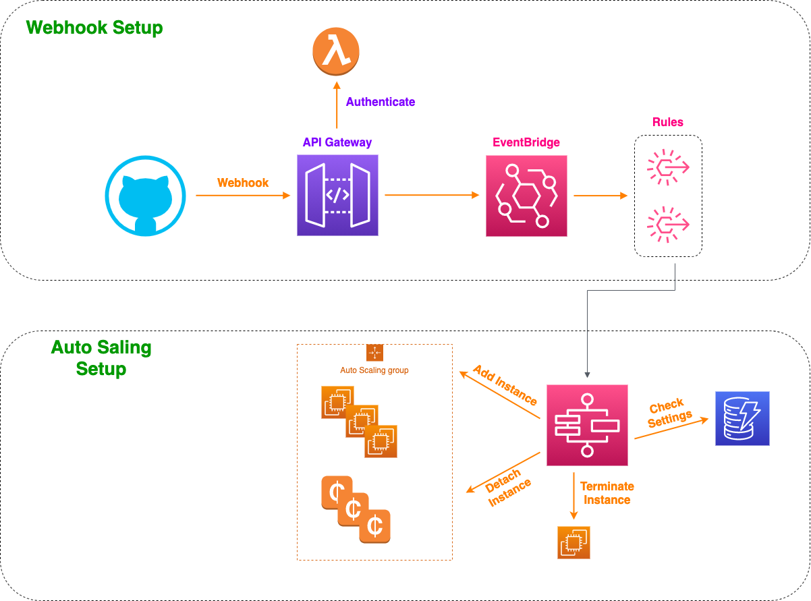
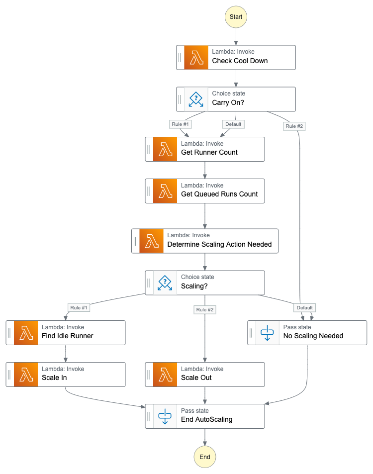

# GitHub AutoScaled Self Hosted Runners on AWS

Setup and run GitHub Actions CI/CD runners on AWS in a auto scaled way. Reacts on GitHub webhooks to trigger auto scaling of EC2 spot instances.

## Architecture Overview



The architecture consists of two parts. Webhook that receives signals from GitHub and Autoscaling that will add and remove EC2 instances in an Auto Scaling Group.

## Infrastructure

The Infrastructure folder contains the base infrastructure needed to receive GitHub webhooks, using API Gateway, authenticate the calls, and add the webhook event to EventBridge, and will setup the needed VPC.

## Runners

The Runners folder contains the base infrastructure for the runners, auto scaling group etc.

## Auto Scaler

The AutoScaler folder contain the infrastructure, and logic, to scale in and out EC2 instances. EC2 spot instances will be used to save cost. Since GitHub require that at least one self hosted runner is running for the job not to fail immediately a Auto Scaling Group will be configure to run one on-demand instance. The scaling logic is implemented in an express flow StepFunction triggered by EventBridge rules on GitHub webhooks, and every 15 minutes. The Auto Scaler is depending on a DynamoDB table with settings and last actions.



### DynamoDB table

To set a cool down period for Auto Scaling add an item "settings_cooldown" with the cooldown period set in milliseconds. You can skip this if cooldown is not used.

### SSM Parameters

You should add GitHub Secrets and Personal Access Tokens needed as secret strings in Parameter Store. The specify the the SSM parameter in the templates.

## Installation

Deploy the base infrastructure using [SAM CLI](https://docs.aws.amazon.com/serverless-application-model/latest/developerguide/serverless-sam-cli-install.html).
When deploying the Infrastructure supply the secret used to authenticate the calls from GitHub. Set "GitHubSecret" to the SSM parameter holding the value.

```

cd Infrastructure
sam build
sam deploy --guided

```

Next deploy the Base Runners. You must supply the PAT with rights to access to GitHub API.

```

cd Runners
sam build
sam deploy --guided

```

Finally deploy the AutoScaler, that will setup a StepFunction as target for the GitHub webhook and implement the logic.

```

cd AutoScaler
sam build
sam deploy --guided

```

## Usage

Point GitHub Repo Webhook to the deployed API gateway, make sure to use the same secret specified when setting up the Infrastructure.

Trigger your GitHub Actions CI/CD pipelines, lean back, and enjoy.